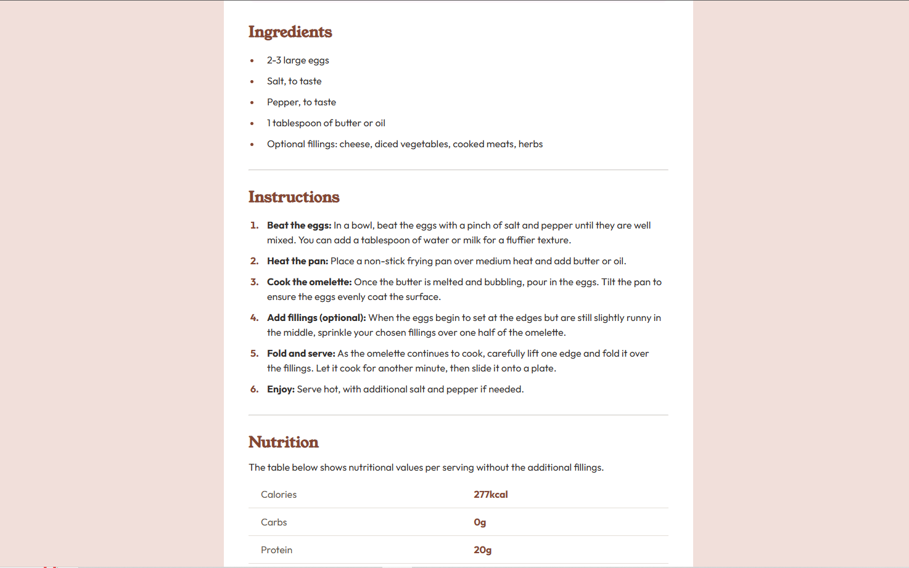

# Frontend Mentor - Recipe page solution

This is a solution to the [Recipe page challenge on Frontend Mentor](https://www.frontendmentor.io/challenges/recipe-page-KiTsR8QQKm). Frontend Mentor challenges help you improve your coding skills by building realistic projects.

## Table of contents

- [Overview](#overview)
  - [The challenge](#the-challenge)
  - [Screenshot](#screenshot)
  - [Links](#links)
- [My process](#my-process)
  - [Built with](#built-with)
- [Author](#author)

**Note: Delete this note and update the table of contents based on what sections you keep.**

## Overview

### Screenshot





### Links

- Solution URL: [Add solution URL here](https://your-solution-url.com)
- Live Site URL: [Add live site URL here](https://your-live-site-url.com)

## My process

### Built with

- Semantic HTML5 markup
- CSS custom properties
- Flexbox
- CSS Media Queries for responsive layout

### What I learned

```html
<div class="header"></div>

```

```css
.recipe-page-container {
  display: flex;
  flex-direction: column;
  background-color: hsl(0, 0%, 100%);
  width: 40%;
  border-radius: 15px;
  padding: 40px;
}

.header {
  background-image: url(assets/images/image-omelette.jpeg);
  background-position: center;
  background-repeat: no-repeat;
  background-size: cover;
  height: 400px;
  margin-bottom: 30px;
  border-radius: 10px;
}
```

## Author

- Frontend Mentor - [@usman-97](https://www.frontendmentor.io/profile/usman-97)
